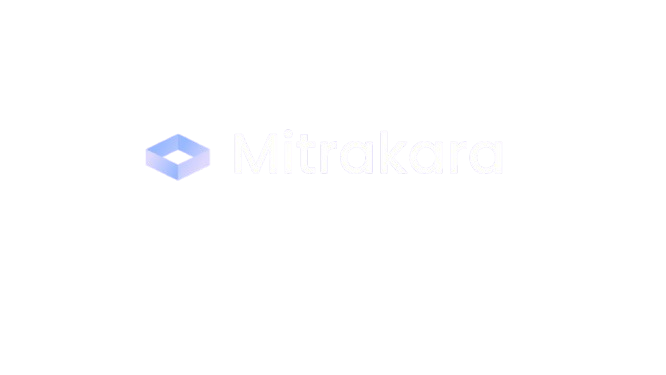
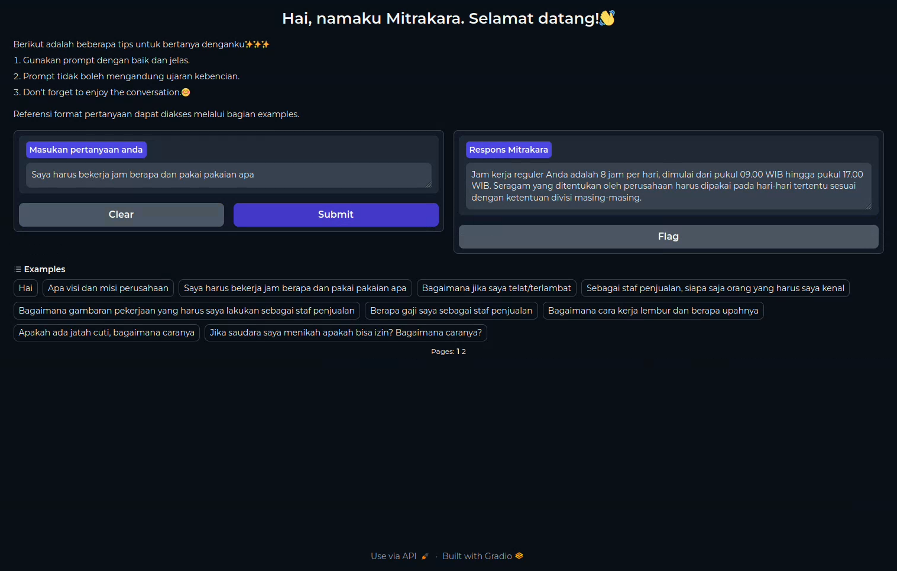

# AIC_TriwiraData
**Ketua tim:** 
1. Marco Aland Adinanda

**Anggota tim:**
1. Ahmad Wildan Jauharul Fuad
2. Dewi Adelia Priyono

## Overview
Dalam pengembangan talenta (talent growth), langkah awal yang diperlukan, terutama untuk karyawan baru, adalah adaptasi lingkungan. Karyawan baru biasanya menjalani orientasi/onboarding terlebih dahulu setelah diterima oleh suatu perusahaan. Orientasi memiliki dampak yang cukup besar terhadap loyalitas dan produktivitas karyawan. Pada tahap ini, terdapat beberapa tantangan tersendiri, seperti informasi berlebih yang didapat dalam waktu yang cenderung singkat, proses administratif yang rumit, kesenjangan budaya, kurangnya pendampingan yang dikarenakan senior yang sibuk, dll. Penggunaan teknologi Artificial Intelligence (AI) dapat menjadi salah satu solusi untuk menyelesaikan permasalahan-permasalahan tersebut. Teknik yang diimplementasikan dalam pengembangan penelitian ini adalah Retrieval-Augmented Generation (RAG).
 
**Apa itu Retrieval-Augmented Generation (RAG)?**
- RAG adalah teknik yang menggabungkan kemampuanLLM dengan sumber data eksternal. Ini memungkinkan model untuk menghasilkan respons yang lebih akurat dan relevan dengan mengakses informasi dari basis data yang ditentukan 

**Apa saja manfaat ChatBot berbasis RAG untuk Perusahaan atau Bisnis?**
- Akses Informasi Cepat dan Akurat: talenta akan mendapatkan informasi yang mereka butuhkan dengan cepat, sehingga akan berdampak kepada efisiensi kerja.
- Meningkatkan Produktivitas: Chatbot juga mampu membantu talent dalam tugas sehari-hari, seperti memberikan motivasi bagi para talent.
- Pembelajaran dan Pengembangan: Dengan diberinya akses langsung ke pengetahuan perusahaan, mendukung pemahaman para stakeholder dalm membuat kebijakan dan prosedur perusahaan/binis.
- Pengambilan Keputusan yang Lebih Baik: Akses cepat ke informasi akurat memungkinkan stakeholders mengkases pengambilan keputusan yang lebih baik dan berdasarkan data asli perusahaan.

Sehingga tim TriwiraData menghadirkan solusi berupa aplikasi dengan nama Mitrakara, yaitu aplikasi berbasis Retrieval-Augmented Generation (RAG) untuk mengoptimalkan proses Talent Growth. 
Nama Mitrakara berasal dari bahasa Sansekerta, di mana kata ini merupakan gabungan dari dua kata: "Mitra" dengan arti teman dan "Kara" yang berarti "yang menghasilkan."



Dengan demikian, **Mitrakara** secara keseluruhan dapat diartikan sebagai "sahabat yang membawa manfaat" atau "teman yang bermanfaat" calam konteks ini berarti Mitrakara mampu membantu para talent sebagai teman dalam bekerja.




## Table of Contents
- [Overview](#overview)
- [Instalasi](#instalasi)
- [Development](#development)
- [Deployment](#deployement)
- [Evaluasi](#evaluasi)

## Instalasi
Dalam proses pengembangan, proses fine-tuning model dilakukan menggunakan `Google Colab T4 GPU`sehingga instalasi dalam proses fine-tuning sudah terdapat pada masing-masing notebook. 

Instalasi yang diperlukan jika ingin menjalakan aplikasi Mitrakara secara lokal melalui `setup.sh` yang terdapat pada direktori "scripts." 

```bash
# make setup.sh as executable
sudo chmod +x setup.sh

# run setup.sh
setup.sh
```

Sebaliknya, jika ingin menjalankan aplikasi Mitrakara melalui google colab maka user tidak perlu menginstall apa pun, cukup hanya menjalankan notebook bernama "Gradio_Deployment.ipynb" yang terdapat pada direktori "notebooks."

## Development
Retrieval-Augmented Generation (RAG) adalah teknik yang menggabungkan model LLM dengan model embedding. Sehingga terdapat dua model yang digunakan sebagai base model, yaitu:
- **Model LLM**: `unsloth/Meta-Llama-3.1-8B-Instruct-bnb-4bit`, dapat diakses melalui https://huggingface.co/unsloth/llama-3-8b-Instruct-bnb-4bit
- **Model Embedding**: `BAAI/bge-m3`, dapat diakses melalui https://huggingface.co/BAAI/bge-m3

Setelah melalui proses fine-tuning kedua model diunggah pada HuggingFace.
Untuk LLM terdapat 2 kali pengunggahan, yaitu: 
- huggingface.co: `MarcoAland/Indo-Llama-3.1-8B-Instruct-bnb-4bit-GGUF`, dapat diakses melalui https://huggingface.co/MarcoAland/Indo-Llama-3.1-8B-Instruct-bnb-4bit-GGUF
- ollama.com: `MarcoAland/llama3.1-rag-indo`, dapat diakses melalui https://ollama.com/MarcoAland/llama3.1-rag-indo
Sedangkan untuk embedding model hanya diunggah 1 kali pada, yaitu:
- huggingface.co: `MarcoAland/Indo-bge-m3`, dapat diakses melalui https://huggingface.co/MarcoAland/Indo-bge-m3

## Deployment
Integrasi kedua model tersebut diimplementasikan menggunakan framework Gradio dengan bantuan Ollama dan HuggingFace untuk deployment. Proses deployment menggunakan resource besar sehingga deployment terdapat 2 pilihan, yaitu:
1. Google colab, dengan menggunakan GPU NVIDIA T4. 
2. Local, dengan source code yang terdapat pada direktori "scripts." 

## Evaluasi
Evaluasi dilakukan dengan menguji sistem RAG menggunakan serangkaian pertanyaan untuk menilai kemampuannya dalam memberikan jawaban atau instruksi yang akurat. Pengujian dapat dilakukan dengan menggunakan pertanyaan pertanyaan berikut:
1. Apa visi dan misi perusahaan?
2. Saya harus bekerja jam berapa dan pakai pakaian apa?
3. Bagaimana jika saya telat/terlambat?
4. Sebagai staf penjualan, siapa saja orang yang harus saya kenal
5. Bagaimana gambaran pekerjaan yang harus saya lakukan sebagai staf penjualan?
6. Berapa gaji saya sebagai staf penjualan?
7. Bagaimana cara kerja lembur dan berapa upahnya?
8. Apakah ada jatah cuti, bagaimana caranya?
9. Jika saudara saya menikah apakah bisa izin? Bagaimana caranya?
10. Bagaimana sanksi jika saya melanggar peraturan?
11. Beri contoh pelanggaran hingga membuat saya di PHK